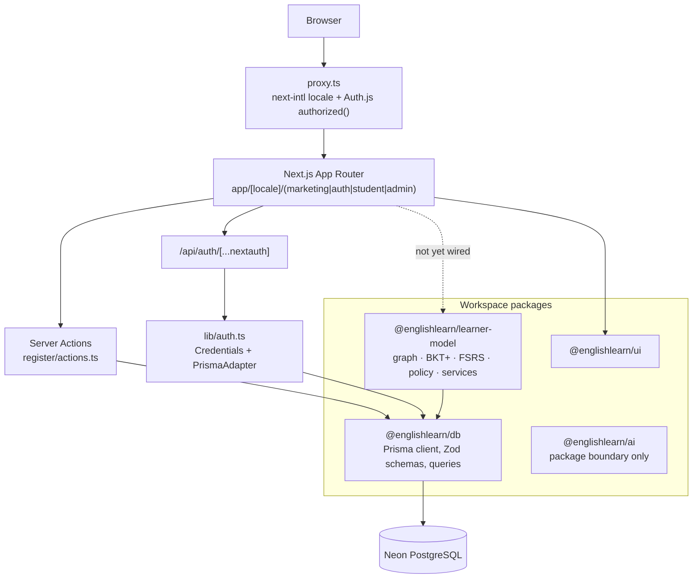
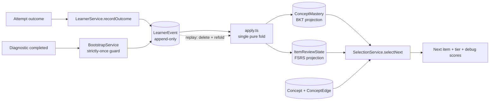

# EnglishLearn

Adaptive English learning platform built around an explicit, testable model of what a learner knows.

Most language apps schedule content with a single heuristic — a review queue, or a fixed syllabus. EnglishLearn separates the problem into three layers (prerequisite graph, per-concept mastery, per-item memory) and puts a bandit policy on top to decide what to show next. The learner model is implemented as a standalone, side-effect-free package with property-based tests, independent of the web app.

**Status:** pre-release (MVP-0.5). The learner model, database schema, authentication and i18n routing are implemented and tested. The web application is a functional scaffold: routes, auth and locale handling work, but the adaptive exercise UI is not yet wired to the selection policy. Nothing has been released to end users. Sections below mark what is implemented and what is not.

---

## Overview

**Problem.** Adult learners (CEFR A2–C1) studying for work, immigration or travel plateau because practice is not targeted. Generic drills spend time on material already known and skip prerequisites that are actually missing.

**Approach.** Model the learner explicitly, then let a selection policy read that model:

- **Layer 3 — Knowledge Graph.** Concepts and typed edges (`PREREQUISITE`, `RELATED`, `CONTRASTS_WITH`, `PART_OF`). Prerequisite edges must form a DAG, enforced by the graph builder.
- **Layer 2 — BKT+.** Bayesian Knowledge Tracing per concept, augmented with an IRT 2PL item-response term and exponential forgetting.
- **Layer 1 — FSRS.** Per-item memory state (stability, difficulty, due date) via `ts-fsrs`.
- **Selection policy.** Concept-level Thompson Sampling over the graph, gated by prerequisite mastery, with review-due items taking priority.

All learner state derives from an append-only event log (`LearnerEvent`). `ConceptMastery` and `ItemReviewState` are materialized projections that can be rebuilt by replaying events through the same pure fold used on the live path.

**Audience.** B2C adult learners. Tutor marketplace and payments are planned, not built.

---

## Key Features

### Implemented

- **Three-layer learner model** (`@englishlearn/learner-model`) — knowledge graph, BKT+ with IRT, FSRS wrapper. Pure functions, no I/O, 158 passing tests.
- **Thompson Sampling selection policy** — concept-level bandit with an informative cold-start prior derived from IRT difficulty, hard prerequisite gating on new concepts, and a three-tier fallback (`REVIEW_DUE` → `NEW_INTRODUCTION` → `EXPLORATION_FLOOR`) that guarantees a non-empty result.
- **Event-sourced learner state** — `LearnerEvent` append-only log, single pure `apply` fold shared by the live write path and replay, one transaction and one timestamp per outcome for bit-exact reproducibility.
- **Diagnostic bootstrap** — a completed diagnostic emits `LEARNER_BOOTSTRAPPED`, mapping per-axis ability estimates to initial concept mastery. Guarded strictly-once inside the writing transaction.
- **Deterministic stochastic core** — seedable RNG (mulberry32 + Marsaglia–Tsang Beta sampler) injected at the policy boundary; `Math.random` is banned in policy code so tests and future offline evaluation are reproducible.
- **Authentication and role-based routing** — Auth.js v5, JWT sessions, credentials provider, edge-safe authorization callback protecting `/admin` and `/tutor` route prefixes.
- **Content schema layer** — Zod-validated JSON payloads for vocabulary, grammar, listening and diagnostic content, with a source/localized split and an editorial lifecycle (`DRAFT → REVIEW → PUBLISHED → ARCHIVED → REJECTED`).
- **Internationalization** — four locales (EN/RU/UK/DE) with `localePrefix: 'as-needed'` routing.

### Not yet implemented

- Adaptive exercise UI — `exercises/page.tsx` is a placeholder; `@englishlearn/learner-model` is not currently a dependency of the web app.
- AI layer — `@englishlearn/ai` exists as a package boundary only; no provider SDK is installed and no prompts are wired.
- Progress analytics dashboards, tutoring platform, payments.

---

## Tech Stack

Versions are pinned centrally in `pnpm-workspace.yaml` via pnpm catalogs and referenced as `catalog:` in every workspace manifest.

| Layer | Technology | Purpose |
| --- | --- | --- |
| Framework | Next.js 16.2.9, React 19.2.7 | App Router, server components, `proxy.ts` (Next 16 replacement for middleware) |
| Language | TypeScript 6.0.3 | `moduleResolution: "Bundler"`, strict, `noUncheckedIndexedAccess` |
| Database | PostgreSQL (Neon) | Primary datastore |
| ORM | Prisma 6.16.2 | Schema, migrations, generated client with `rhel-openssl-3.0.x` target for serverless |
| Auth | Auth.js v5 (`next-auth@5.0.0-beta.31`) | JWT sessions, credentials provider, Prisma adapter |
| Validation | Zod 4.4 | Content payloads, event payloads, credentials, env parsing |
| Spaced repetition | `ts-fsrs` 5.2.3 | FSRS scheduling, imported by exactly one wrapper module |
| i18n | next-intl 4.13 | Locale routing and message catalogs (en/ru/uk/de) |
| Styling | Tailwind CSS 4.3.1 | Utility styling; the current UI is functional, not final design |
| Client state | TanStack Query 5, Zustand 5 | Server-state cache and local UI state |
| Forms | React Hook Form 7.80 + `@hookform/resolvers` | Form handling with Zod resolvers |
| Env | `@t3-oss/env-nextjs` | Typed, validated environment access |
| Testing | Vitest 4.1.9, fast-check 3.23.2, Playwright 1.61 | Unit, property-based and end-to-end tests |
| Tooling | Turborepo 2.10, pnpm 10 (catalogs), Biome 2.5 | Task orchestration, dependency pinning, lint + format |
| CI | GitHub Actions | Lint, typecheck, test, build, and a separate Playwright job against a Postgres service container |
| Runtime | Node.js ≥ 22 | Enforced via `engines` and `.nvmrc` |

---

## Architecture

A pnpm workspace with one application and five packages. Dependency direction is strictly one-way: the app depends on packages, packages never depend on the app.



The dashed edge is deliberate: the learner model is complete and tested at the package level, but the web app does not import it yet. See [Known Limitations](#known-limitations).

### Learner model data flow



Two properties this buys: writes go through exactly one path (no direct `UPDATE` on projections), and any user's state can be rebuilt from the log using the same code that produced it live. Replay equivalence has been verified against the live path.

### Request lifecycle

`proxy.ts` composes two concerns in order — `next-intl` resolves the locale, then the Auth.js `authorized` callback decides access. The callback is deliberately kept in `lib/auth.config.ts` with an empty `providers` array so it stays edge-safe; the database adapter and credentials provider live in `lib/auth.ts`, which is only loaded in the Node.js runtime.

---

## Project Structure

```text
englishlearn/
├── apps/
│   └── web/
│       ├── app/
│       │   ├── [locale]/
│       │   │   ├── (marketing)/       # public landing
│       │   │   ├── (auth)/            # login, register (+ server action)
│       │   │   ├── (student)/         # dashboard, diagnostic, exercises
│       │   │   └── (admin)/           # content moderation, users, ai-review
│       │   └── api/auth/[...nextauth]/
│       ├── i18n/                      # routing, request config, navigation
│       ├── lib/                       # auth.ts, auth.config.ts, env.ts
│       ├── messages/                  # en.json, ru.json, uk.json, de.json
│       ├── tests/                     # unit (vitest) + e2e (playwright)
│       └── proxy.ts                   # Next 16 middleware replacement
├── packages/
│   ├── db/
│   │   ├── prisma/                    # schema.prisma + 7 migrations
│   │   └── src/
│   │       ├── schemas/               # Zod: exercises, items, learner-events
│   │       ├── queries/
│   │       └── seed.ts
│   ├── learner-model/
│   │   ├── src/
│   │   │   ├── core/{graph,bkt,fsrs}/ # pure layers 3, 2, 1
│   │   │   ├── policy/                # Thompson Sampling, curriculum gating, RNG
│   │   │   ├── diagnostic/            # theta estimation, bootstrap mapping
│   │   │   ├── adapters/              # pure state <-> DB row
│   │   │   └── service/               # event store, apply fold, services, replay
│   │   └── seed/                      # concepts, edges, items
│   ├── ui/                            # button, card, input
│   ├── ai/                            # package boundary, not implemented
│   └── config/                        # shared tsconfig presets
├── .github/workflows/ci.yml
├── turbo.json
├── pnpm-workspace.yaml                # dependency catalog
└── vercel.json
```

Key boundaries:

- **`packages/db`** is the only place Prisma is instantiated. It also owns the Zod schemas that validate every JSON column before it reaches the database.
- **`packages/learner-model`** contains no I/O in `core/`, `policy/`, `diagnostic/` or `adapters/`. Database access is isolated behind a `LearnerModelDb` port with a single Prisma implementation, which is what makes the service layer testable with an in-memory fake.
- **`packages/config`** holds four tsconfig presets (`base`, `library`, `nextjs`, `react-library`) that every workspace extends.

---

## How It Works

**1. Content model.** `Concept` nodes carry a CEFR level and a category. `Item` rows are atomic reviewable units attached to a concept, each carrying IRT 2PL parameters (`irtDiscrimination`, `irtDifficulty`). `Item` is deliberately distinct from `Exercise`: an exercise is a delivery vehicle, an item is the underlying fact whose memory is tracked.

**2. Cold start.** A learner completes the diagnostic. The `ThetaEstimator` interface produces a per-axis ability estimate (currently accuracy-based; an IRT 2PL implementation can replace it without touching the mapping code). `buildBootstrapSnapshots` maps ability to initial `pKnown` under a versioned formula, and emits a single `LEARNER_BOOTSTRAPPED` event carrying the full snapshot plus the constants used — so a later formula revision does not rewrite history.

**3. Selection.** `selectNext` reads the graph, mastery projections and FSRS review states, then resolves in tiers:

- items due for review are returned first;
- otherwise a concept is chosen by Thompson Sampling among concepts whose direct prerequisites exceed the mastery threshold;
- otherwise an exploration floor guarantees a non-empty response.

The Beta posterior for each concept starts from an informative prior derived from content difficulty rather than a uniform `Beta(1,1)`, which prevents erratic recommendations for a brand-new learner.

**4. Recording an outcome.** `recordOutcome` runs one transaction: insert the event, read both projections *inside* the transaction, apply the pure fold, upsert both projections with a single shared timestamp. The event payload is self-contained — it denormalizes the concept id and freezes the IRT parameters as they were at the time — so replay never depends on mutable content rows.

**5. Reward strategy.** `reward.ts` dispatches between `bernoulli`, `learning_gain` and `hybrid`. `learning_gain` is the intended target, but a calibration gate forces `bernoulli` until there are enough observations per concept to trust the parameters. Switching strategies is a configuration change, not a refactor.

---

## Getting Started

### Prerequisites

- Node.js ≥ 22 (`.nvmrc` is provided; `nvm use`)
- pnpm ≥ 10
- A PostgreSQL 16 database. Neon is what this project targets; any Postgres works locally.

### Installation

```bash
git clone <repository-url>
cd englishlearn
pnpm install
```

### Environment Variables

Copy the example file and fill it in:

```bash
cp apps/web/.env.example apps/web/.env
```

The Prisma CLI only reads `.env` from the package it runs in, so the database variables must also exist in `packages/db/.env`:

```bash
printf 'DATABASE_URL="..."\nDIRECT_URL="..."\n' > packages/db/.env
```

| Variable | Required | Description |
| --- | ---: | --- |
| `DATABASE_URL` | Yes | Postgres connection string. On Neon this is the **pooled** endpoint, used at runtime. |
| `DIRECT_URL` | Yes | Direct (non-pooled) connection, declared as `directUrl` in the Prisma datasource. Required for migrations and DDL — a connection pooler can silently drop schema changes. |
| `AUTH_SECRET` | Yes | Auth.js signing secret. Generate with `openssl rand -base64 32`. |
| `AUTH_URL` | No | Auto-detected on Vercel; set explicitly when self-hosting. |
| `AUTH_TRUST_HOST` | No | Set behind a reverse proxy or on a serverless host. |
| `AUTH_GOOGLE_ID` | No | Reserved. Google OAuth is not wired — only the credentials provider is registered. |
| `AUTH_GOOGLE_SECRET` | No | Reserved, as above. |
| `ANTHROPIC_API_KEY` | No | Reserved for the AI layer; not consumed by any code yet. |
| `OPENAI_API_KEY` | No | Reserved, as above. |
| `SKIP_ENV_VALIDATION` | No | Bypasses env schema validation. Used in CI, where a real database is not configured. |

No secrets are committed. `.env` files are gitignored; only `apps/web/.env.example` is tracked.

### Database Setup

```bash
pnpm db:generate                                    # generate the Prisma client
pnpm --filter @englishlearn/db migrate:deploy       # apply migrations
pnpm db:seed                                        # users, skill tags, exercises
pnpm --filter @englishlearn/learner-model seed:concepts
pnpm --filter @englishlearn/learner-model seed:items
```

Migrations are generated with `prisma migrate diff` rather than `migrate dev`, because Neon provides no shadow database:

```bash
cd packages/db
pnpm exec prisma migrate diff \
  --from-url "$DIRECT_URL" \
  --to-schema-datamodel prisma/schema.prisma \
  --script > prisma/migrations/<name>/migration.sql
pnpm exec prisma migrate deploy
```

`migrate diff --from-url` takes a raw URL and bypasses the datasource, so the direct connection string must be passed explicitly there. `migrate deploy`, `migrate status` and `db execute` read `directUrl` from the schema on their own.

### Development

```bash
pnpm dev          # Next.js dev server on http://localhost:3000
pnpm build        # production build of all workspaces
pnpm typecheck    # tsc --noEmit across every package
pnpm test         # unit + property-based tests
pnpm test:e2e     # Playwright
pnpm check        # Biome lint + format, applying fixes
```

---

## Available Scripts

| Command | Description |
| --- | --- |
| `pnpm dev` | Run the dev server via Turborepo |
| `pnpm build` | Build all workspaces (generates the Prisma client first) |
| `pnpm lint` | Biome lint |
| `pnpm format` | Biome format, writing changes |
| `pnpm check` | Biome lint + format + import organization, writing changes |
| `pnpm typecheck` | `tsc --noEmit` in every package |
| `pnpm test` | Vitest across all packages |
| `pnpm test:e2e` | Playwright end-to-end tests |
| `pnpm db:generate` | Generate the Prisma client |
| `pnpm db:migrate` | `prisma migrate dev` |
| `pnpm db:push` | `prisma db push` (used by CI against a throwaway database) |
| `pnpm db:seed` | Seed users, skill tags and exercises |
| `pnpm db:studio` | Prisma Studio |
| `pnpm clean` | Remove build artifacts and `node_modules` |

---

## Testing

Vitest for unit and property-based tests, Playwright for end-to-end. Every package defines its own `vitest.config.ts`; Turborepo runs them together.

`@englishlearn/learner-model` — **158 tests across 15 files**, the substantive suite:

| Area | Files | What is covered |
| --- | --- | --- |
| Knowledge graph | `core/graph/__tests__/` | Graph construction, traversal, and property-based invariants (DAG validity, prerequisite closure) via fast-check |
| BKT+ | `core/bkt/__tests__/` | Posterior updates, IRT 2PL response term, exponential forgetting, boundary behaviour |
| FSRS | `core/fsrs/__tests__/` | Scheduling wrapper, grade mapping, determinism with fuzz disabled |
| Adapters | `adapters/__tests__/` | Round-trip between pure state and database row shapes |
| Policy | `policy/__tests__/` | Seeded RNG distribution, reward strategy dispatch and calibration gating, prerequisite gating, and the no-starvation invariant of `selectNext` |
| Diagnostic | `diagnostic/__tests__/` | Ability estimation and the ability-to-mastery mapping, including floor/ceiling clamping |
| Services | `service/__tests__/` | `recordOutcome`, `selectNext` and bootstrap orchestration against an in-memory implementation of the database port |

`@englishlearn/db` — Zod schema tests for exercise content, item content and locale handling, including fast-check property tests.

`@englishlearn/ui` — component test for `Button` (Testing Library + jsdom).

`@englishlearn/web` — unit tests for the Auth.js `authorized` callback covering guest, student and admin access to public, student and admin routes; plus one Playwright smoke spec.

The database port abstraction is what makes the service layer testable without a database: `LearnerModelDb` is an interface, `prisma-db.ts` is the only implementation used in production, and the test suite substitutes an in-memory fake.

---

## Code Quality

- **Biome 2.5** for lint and format. Unused variables and unused imports are errors; `any` and non-null assertions are warnings; `console` is restricted to `error`/`warn`/`info`. Import organization runs as an assist action.
- **TypeScript strict mode** with `noUncheckedIndexedAccess`, shared through four presets in `packages/config`.
- **Conventional Commits.**
- **Editor consistency** via `.editorconfig`; single quotes, 2-space indent, 100-column width, LF endings.

### CI

`.github/workflows/ci.yml` runs on pushes and pull requests to `main`. Two jobs, both against a `postgres:16` service container with a health check:

1. **`ci`** — install, generate Prisma client, push schema, lint, typecheck, unit tests, build.
2. **`e2e`** — depends on `ci`; seeds the database, installs Chromium, runs Playwright, uploads the report as an artifact with 7-day retention.

### Deployment configuration

`vercel.json` configures a monorepo build (install and build both run from the workspace root with a `--filter` on the web app) and an `ignoreCommand` that skips deploys when neither `apps/web` nor `packages` changed. `next.config.ts` sets `outputFileTracingRoot` to the monorepo root and explicitly traces the generated Prisma client, and marks `@prisma/client` and `bcryptjs` as external server packages for the serverless runtime. The Prisma generator emits an `rhel-openssl-3.0.x` binary target alongside the native one.

---

## API / Backend

There is no separate API service. The backend consists of:

- **`/api/auth/[...nextauth]`** — the only route handler, mounting the Auth.js handlers.
- **Server Actions** — `app/[locale]/(auth)/register/actions.ts` handles registration.
- **Server Components** — pages read through `@englishlearn/db` directly on the server.

Adding a general-purpose API layer was deliberately deferred: with a single Next.js consumer, server actions and server components cover the surface without an extra abstraction.

---

## Authentication & Authorization

Auth.js v5 with JWT sessions and a credentials provider. Passwords are hashed with bcrypt; `passwordHash` is nullable so OAuth-only accounts remain representable. The Prisma adapter persists `Account`, `Session` and `VerificationToken`.

The configuration is split in two on purpose:

- `lib/auth.config.ts` — edge-safe. No adapter, no providers, just the `authorized`, `jwt` and `session` callbacks. This is what `proxy.ts` imports, so route protection runs without pulling Prisma into the edge bundle.
- `lib/auth.ts` — the full instance with the Prisma adapter and the credentials provider, used by the route handler and server-side code.

Authorization is role-based (`STUDENT`, `TUTOR`, `ADMIN`) and enforced by path prefix in the `authorized` callback: `/`, `/login`, `/register` and `/api/auth` are public; `/admin` requires `ADMIN`; `/tutor` requires `TUTOR` or `ADMIN`; everything else requires a session. The role is written into the JWT on sign-in and surfaced on the session, with the `next-auth` module augmented in `types/next-auth.d.ts` so `session.user.role` is typed.

---

## Internationalization

`next-intl` with four locales — English, Russian, Ukrainian, German — under `app/[locale]/` with `localePrefix: 'as-needed'`, so the default locale has no prefix. UI strings live in `messages/*.json`; no user-facing text is hardcoded.

Content localization uses a different mechanism. Exercise and item content is stored in `Json` columns validated by Zod, structured as a `source` object (locale-independent: the target lexeme, the grammar template, the audio URL) and a `localized` object keyed by locale. English is required and acts as the fallback. This keeps translations additive — a new locale is new keys, not a schema migration.

---

## Engineering Decisions

**Pure cores, isolated I/O.** The graph, BKT, FSRS and policy layers are pure functions over plain data. Database access sits behind the `LearnerModelDb` port. This is what makes property-based testing viable — fast-check can hammer the BKT update or the graph builder with thousands of generated inputs because neither touches a network.

**Event sourcing with a single fold.** Rather than updating mastery in place, outcomes are appended to `LearnerEvent` and folded into projections. Crucially the live path and the replay path call the *same* `apply` function, so replay cannot drift from production behaviour. Events carry self-contained snapshots — denormalized concept id, frozen IRT parameters — so recalculating history does not depend on content rows that may have changed since.

**Banning `Math.random` in policy code.** All stochasticity flows through an injected seedable RNG. Without this, a Thompson Sampling policy is untestable and offline evaluation is impossible. The same reasoning led to disabling FSRS fuzz.

**Informative priors over uniform.** A new learner's Beta prior is derived from the IRT difficulty of the concept's content rather than `Beta(1,1)`. A uniform prior produces essentially random first recommendations, which is a bad first session.

**Calibration gates instead of premature sophistication.** IRT parameters default to `a=1.0, b=0.0` and are not trusted until there are enough observations. Consequently the diagnostic uses an accuracy-based ability estimator rather than a full 2PL MLE — at neutral parameters the MLE degenerates to `logit(accuracy)` anyway, so the extra machinery would buy false precision. The estimator sits behind an interface so the IRT implementation can drop in later without touching the mapping code. The same pattern gates the reward strategy.

**Migrating without a shadow database.** Neon provides no shadow database, so the workflow uses `migrate diff` against the direct connection plus `migrate deploy`, rather than `migrate dev`. The direct URL matters: a connection pooler can accept DDL and silently not apply it.

**Typed columns for IRT, JSON for content.** Item parameters that the model reads on every selection are real Postgres columns with indexes. Content that is only rendered is JSON validated at the boundary by Zod. This avoids both a rigid schema for prose and unindexed math.

**pnpm catalogs.** Every dependency version is declared once in `pnpm-workspace.yaml` and referenced as `catalog:`. Six workspaces cannot drift onto different React or Zod versions.

**Prisma enum as canonical.** Where an enum needs a runtime counterpart, the Prisma enum is the source of truth and the Zod twin is named `XxxValue`/`XxxSchema` to avoid export collisions from the `db` barrel.

**Human-readable, immutable identifiers.** Concepts use dotted snake_case ids (`present_perfect.with_for_since`) and seed items use `item.<concept>.<slug>`, which makes seeding idempotent and event payloads readable during debugging.

---

## Known Limitations

Stated plainly, since they are design consequences rather than oversights:

- **The learner model is not connected to the UI.** `@englishlearn/learner-model` is not a dependency of `apps/web`; `exercises/page.tsx` is a placeholder. The model is verified at the package level and against a live database via throwaway scripts, but no user-facing flow reads it yet. This is the top item on the roadmap.
- **Diagnostic bootstrap does not reach the bandit.** `LEARNER_BOOTSTRAPPED` writes `ConceptMastery.pKnown`, but `betaParamsForConcept` in `policy/posterior.ts` reads only event counts and mean item difficulty — the bootstrap signal never enters the Thompson prior. A statistical check over 2,000 samples confirmed no significant shift in selection (z ≈ −0.02). Separately, the bootstrap ceiling (0.60) sits below the prerequisite threshold (0.70), so a diagnostic alone can never open a curriculum gate. Both are documented and deferred deliberately: the weighting between diagnostic signal and observed outcomes should be tuned against real usage, not guessed.
- **IRT parameters are uncalibrated.** All items carry neutral defaults. Meaningful calibration needs on the order of 500 outcomes per item.
- **Content is demo-scale.** 15 concepts, 10 edges, 60 items. Enough to exercise the model, not enough for a real learner.
- **Per-user BKT parameters are placeholders.** `pLearn`, `pSlip` and `pGuess` use shared defaults pending calibration data.
- **Prerequisite gating checks direct parents only.** Transitivity is implicit through the recursive structure rather than computed as a closure.
- **The listening axis is inert.** Ability is estimated for it, but no seed concept carries the `LISTENING` category, so the signal currently has nowhere to go. It activates when listening concepts are added, with no code change.
- **Pinned to Prisma 6.16.2.** Prisma 7 changes `datasource.url` handling; the upgrade is deferred.
- **`@englishlearn/ai` is an empty boundary.** No provider is integrated.
- **No observability.** Error tracking and product analytics are not set up.

---

## Roadmap

Near term:

1. Adaptive exercise UI reading `selectNext`, closing the gap between the model and the application.
2. Connect the bootstrap signal to the bandit prior — extend `betaParamsForConcept` to accept mastery input, with the weighting tuned against real usage.
3. Progress dashboard presenting CEFR-level semantics rather than raw probabilities.
4. End-to-end learner flow: guest → registration → diagnostic → exercises.
5. Expand the content pool beyond demo scale.
6. Error tracking and product analytics.

Later: AI tutor (requires the provider strategy to be settled), offline evaluation harness for the selection policy, tutoring platform with video and a shared whiteboard, payments and subscriptions.

---

## License

All rights reserved. This repository is published for review; no license to use, copy, modify or distribute is granted.
